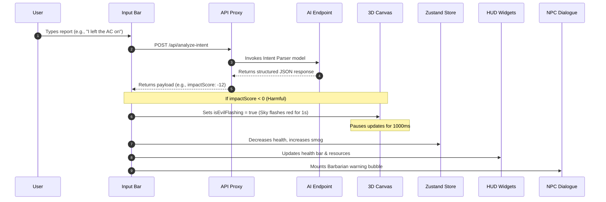

# Carbon Clash 🌍⚔️

**Carbon Clash** is an interactive, gamified web application designed to drive behavioral change and raise carbon footprint awareness. Inspired by real-time strategy (RTS) base-building mechanics (specifically *Clash of Clans*), the platform translates real-world sustainability actions into immediate visual consequences in a live 3D village.

Users report their daily actions (e.g., *"I rode my bicycle to work"* or *"I drove my petrol bike to the mall"*). An AI parser scores their choice, and the Town Hall, surrounding forests, atmosphere, and NPCs visibly react.

---

## 🏗️ Technical Stack

* **Core & Styling:** React (v18), Vite, Vanilla CSS
* **3D Gamification Engine:** Three.js via `@react-three/fiber` (R3F) & `@react-three/drei`
* **State Management:** Zustand
* **AI Intent Parsing & Scoring:** Google Gemini API (`gemini-2.5-flash`) for both local development and production serverless deployment.
* **Testing:** Jest (Unit) + Playwright (End-to-End)

---

## 🎨 Visual Aesthetics & Design System

The UI features a customized medieval RTS style:
* **Widgets (Resource Bars):** Positioned along the top, styled as gold-trimmed dark wooden planks with glossy progress tracks:
  * **Town Hall Health:** A green status bar with a shield icon (🛡️).
  * **Atmosphere Smog:** A pink/purple elixir-like status bar with a smog icon (💨).
  * **Trees Planted:** A counter tracking manually planted trees (🌳).
  * **Village Status:** A crown-emblemed indicator showing the village health status (👑).
* **Recent Deeds Scroll:** A wooden billboard on the right logging recent actions and their scores.
* **Dialogue Speech Bubbles:** The onboarding guide (Sarah) speaks via medieval parchment dialog bubbles with dark wood borders and green 3D buttons.
* **Control deck:** The NLP report input bar is styled as a heavy wood panel with a cream paper input and a green 3D button.

---

## 🎮 3D Gamification Mechanics

The 3D environment reacts dynamically to user actions:

### 1. Town Hall Mesh
* **Interactive Health states:** The Town Hall changes body colors (vibrant mossy green when thriving, critical red when strained), grows visible stone cracks, dims window glows, and changes flag colors.
* **Damage Feedback:** Any negative choice triggers a direct structural camera shake effect.

### 2. Animated Scenery Buildings
To populate the village, three custom low-poly models are placed in the environment:
* **Builder's Hut:** A cozy wooden hut with a sloped straw roof, side window, and outside carpenter's workbench.
* **Gold Mine:** A stone-and-wood mine shaft opening featuring a cart loaded with shiny, metallic gold crystals.
* **Elixir Collector:** A bronze-plated base and copper pipes supporting a transparent cylinder containing pink elixir liquid that pulses over time.

### 3. Villagers & Workers ("Men Working")
* **Builder:** Stands near the Town Hall entrance, actively swinging a hammer up and down against a wood block.
* **Gardener:** Bends and digs a soil mound with an animated shovel near the flower beds.

### 4. Dynamic Sky & Fog
* **Daylight & Haze:** High health keeps the sky clear blue with glowing fireflies. High pollution builds a thick grey-yellow smog cover.
* **Evil Sky Flash:** When a harmful choice is registered, the background instantly flashes dark red (`#3a0505`), the sun light turns deep red (`#ff0000`) with boosted intensity (`2.5`), and the fog immediately pulls in dense around the village center.

---

## 🧠 AI Intent Parsing & Greenhouse Gas Directives

The AI evaluates actions on a scale of `-25` (severe harm) to `+25` (highly positive) and returns a specific, structured remedy.

### Localization & Transportation
* **"Bike"** is interpreted as a gasoline-powered motorbike/motorcycle, yielding a carbon-negative score.
* **"Bicycle"** is human-powered, yielding a carbon-positive score.

### Scientific Greenhouse Gas Formulas
When a harmful choice is submitted, the remedy is instructed to reference specific chemical gas formulas:
1. **Travel/Fossil Fuels:** The remedy starts with *"The CO2 ghost is coming for you!"*
2. **Waste, Diet, or Garbage:** The remedy references **$\text{CH}_4$** (Methane).
3. **Soil, Fertilizer, or Farming:** The remedy references **$\text{N}_2\text{O}$** (Nitrous Oxide).
4. **Industrial, Cooling (AC), or Electronics:** The remedy references **$\text{SF}_6$**, **$\text{NF}_3$**, or **HFCs**.

---

## 🔄 Interaction Sequence



---

## 📂 Project Layout

```
/carbon-clash
├── api/
│   └── analyze-intent.js        # Serverless endpoint targeting Google Gemini (Production)
├── src/
│   ├── components/
│   │   ├── FloatingNlp.jsx       # Chat input box and hint loops (CoC wood deck)
│   │   ├── HudOverlay.jsx        # Resource indicators & log of deeds scroll
│   │   └── NpcDialogue.jsx       # Onboarding guide (Sarah) & Barbarian alerts
│   ├── gamification/
│   │   ├── Environment.jsx       # 3D assets: trees, workers, extra buildings, fog, evil flash
│   │   ├── GameCanvas.jsx        # Canvas container with zoom lock and static OrbitControls
│   │   └── TownHallMesh.jsx      # Town Hall structural models, colors, and cracks
│   ├── store/
│   │   └── gameStore.js          # Zustand store: health, smog, dynamic tree counts, flashes
│   ├── styles/
│   │   └── theme.css             # Main styling, typography, variables, keyframe animations
│   ├── services/
│   │   └── geminiClient.js       # API request boundary
│   └── utils/
│       └── gameLogic.js          # Pure game scoring math and threshold classification
├── tests/
│   ├── calculator.test.js        # Unit tests verifying health & pollution formulas
│   └── edgeCases.test.js         # Mocks fetch to verify fallback on proxy errors
└── e2e/
    └── userLoop.spec.js          # Playwright E2E smoke tests for onboarding / HUD
```

---

## 🚀 Setup & Execution

### 1. Install Dependencies
```bash
npm install
```

### 2. Configure Environment Variables
Create a `.env` file in the root directory:
```env
# Google Gemini API Config
GEMINI_API_KEY=your_gemini_api_key_here
GEMINI_MODEL=gemini-2.5-flash
```

### 3. Run Locally
```bash
# Start Vite Development Server (includes local API proxy)
npm run dev
```
Open `http://localhost:5173/` in your browser.

---

## 🧪 Testing

The test suite validates logic, proxy fallbacks, and user interaction flows.

### Unit & Boundary Tests (Jest)
Run unit tests checking calculation parameters and error boundaries:
```bash
npm test
```
* `tests/calculator.test.js` ensures that health/pollution adjustments stay bounded within 0–100 limits.
* `tests/edgeCases.test.js` mocks `fetch` to ensure the interface defaults to non-breaking fallbacks (e.g. `{ impactScore: 0, category: 'unknown' }`) if the scoring server goes offline.

### End-to-End Tests (Playwright)
Verify interactive HUD widgets and the tutorial flow:
```bash
npm run test:e2e
```
